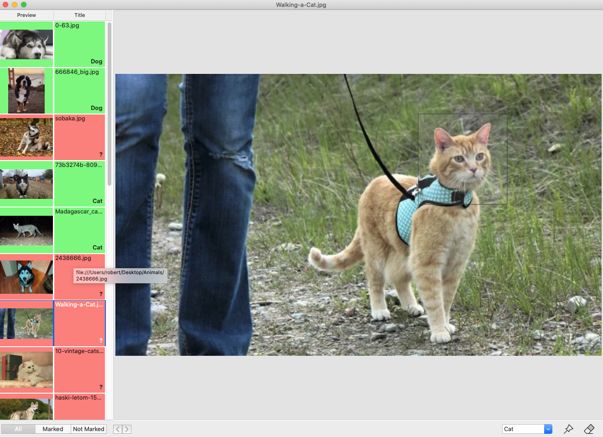

# Image Annotation Tool
A very simple image annotating tool.
I created it just for solving the image annotation problem, when I was playing with object detection with Turicreate.
You can easily modify this software to fulfill your special needs.

## Requirements
* XCode 11.4
* Swift 5.1
* Mac OS

## Installing
No special requirements for installing. Just compile the source code.

## How to use
Use main menu to: 
* open a folder with images (only 'png', 'jpg', 'jpeg' file formathes will be loaded)
* manage labels
* save the generated apple ML compatible JSON file

## JSON file formath
The generated JSON format is a list of annotation structures.
The annotation structure contains the next fields:
 * label - the associated label with the selected image part 
 * imageURL - the full URL to the image
 * type - rectangle
 * coordinates - the coordinate of the rectangle in image coordinate system
    *	y - y coordinate of the selection rectangles center
    * x - x coordinate of the selection rectangles center
    * width
    * height

## Author
Robert Fogash

## License
This project is licensed under the MIT License - see the LICENSE.md file for details
